# 大学生学习效率与任务管理平台

一款面向大学生的学习管理系统，包含微信小程序（学生端）和 Web 管理后台（管理员端），提供课表管理、待办任务、番茄专注、笔记记录、错题整理和统计分析等功能。

## 系统架构

```
                        ┌─────────────────────────────────────────────────┐
                        │              MySQL  (learning_assistant)          │
                        │  users / courses / todos / notes / wrong_questions│
                        │  focus_records / term_configs                     │
                        └───────────────┬───────────────────┬──────────────┘
                                        │                   │
                    ┌───────────────────┴──┐   ┌────────────┴──────────────────┐
                    │  小程序后端  :8080     │   │  管理后端  :8081               │
                    │  Spring Boot 2.7.18   │   │  Spring Boot 2.7.18           │
                    │  MyBatis 2.3.2        │   │  Spring Security + MyBatis    │
                    │  无认证 (开放 API)     │   │  Session/Cookie 认证           │
                    └───────────┬───────────┘   └────────────┬──────────────────┘
                                │                            │
                    ┌───────────┴───────────┐   ┌────────────┴──────────────────┐
                    │  微信小程序 (学生端)    │   │  Vue3 管理后台 (管理员端)       │
                    │  原生 WXML+WXSS+JS     │   │  Vue3 + Vite4 + Element Plus  │
                    │  5 个 Tab 页面          │   │  axios + vue-router4          │
                    └───────────────────────┘   └───────────────────────────────┘
```

**双后端共享同一个 MySQL 数据库**：小程序后端（`:8080`）为学生端提供数据读写 API，管理后端（`:8081`）为管理员提供后台管理能力，通过 Spring Security 保护接口安全。

## 技术栈

| 端 | 技术 | 版本 |
|----|------|------|
| 小程序前端 | 微信小程序原生（WXML + WXSS + JavaScript） | — |
| 小程序后端 | Spring Boot + MyBatis | 2.7.18 / 2.3.2 |
| 管理后台前端 | Vue3 + Vite + Element Plus + axios | 3.3.4 / 4.4.5 / 2.4.0 |
| 管理后台后端 | Spring Boot + Spring Security + MyBatis | 2.7.18 / 2.3.2 |
| 数据库 | MySQL（utf8mb4_unicode_ci） | 5.7+ |
| 构建工具 | Maven（后端）/ Vite（前端）/ 微信开发者工具（小程序） | 3.8+ |

## 项目结构

```
SSLearning/
├── frontend/                          # 微信小程序（学生端）
│   └── miniprogram/
│       ├── app.js / app.json          # 小程序入口与配置
│       ├── pages/                     # 页面目录
│       │   ├── index/                 # 课表页（首页 Tab）
│       │   ├── todo/                  # 待办列表（Tab）
│       │   ├── focus/                 # 番茄专注（Tab）
│       │   ├── notes/                 # 笔记列表（Tab）
│       │   ├── stats/                 # 统计分析（Tab）
│       │   ├── focus-history/         # 专注历史
│       │   ├── todo-add/              # 新增待办
│       │   ├── course-add/            # 新增课程
│       │   ├── note-add/              # 新增笔记
│       │   └── wrong-add/             # 新增错题
│       └── icons/                     # 图标资源
│
├── backend/                           # 小程序后端服务（:8080）
│   ├── pom.xml
│   └── src/main/
│       ├── java/com/example/app/
│       │   ├── Application.java
│       │   ├── config/                # CorsConfig, EncodingFilter, WebConfig
│       │   ├── controller/            # 8 个 Controller（REST API）
│       │   ├── entity/                # 7 个实体类
│       │   ├── mapper/                # 7 个 MyBatis Mapper 接口
│       │   └── service/               # Service 接口 + impl 实现
│       └── resources/
│           ├── application.yml        # 端口 8080，无认证
│           ├── mapper/*.xml           # MyBatis SQL 映射
│           └── schema.sql             # 建表脚本
│
├── Back-end Management/               # 管理后台系统
│   ├── frontend-admin/                # Vue3 管理后台前端
│   │   ├── package.json
│   │   ├── vite.config.js             # 开发端口 3000，代理 /admin-api → :8081
│   │   └── src/
│   │       ├── main.js                # 入口（注册 Element Plus + 图标）
│   │       ├── App.vue                # 根组件（纯 <router-view/>）
│   │       ├── router/index.js        # 路由配置 + 路由守卫
│   │       ├── utils/request.js       # axios 封装（拦截器 + 401 跳转）
│   │       ├── api/                   # 8 个 API 模块
│   │       │   ├── auth.js            # 登录/登出/当前用户
│   │       │   ├── user.js            # 用户管理
│   │       │   ├── course.js          # 课程管理
│   │       │   ├── focus.js           # 专注记录
│   │       │   ├── note.js            # 笔记管理
│   │       │   ├── wrong.js           # 错题管理
│   │       │   ├── todo.js            # 待办管理
│   │       │   └── term.js            # 学期配置
│   │       ├── components/
│   │       │   └── Layout.vue         # 主布局（顶栏 + 侧边栏 + 内容区）
│   │       └── pages/                 # 8 个页面
│   │           ├── Login.vue          # 登录页
│   │           ├── UserList.vue       # 用户管理
│   │           ├── CourseList.vue     # 课程管理
│   │           ├── FocusList.vue      # 专注记录
│   │           ├── NoteList.vue       # 笔记管理
│   │           ├── WrongList.vue      # 错题管理
│   │           ├── TodoList.vue       # 待办管理
│   │           └── TermList.vue       # 学期配置
│   │
│   └── backend-admin/                 # 管理后台后端
│       ├── pom.xml
│       └── src/main/
│           ├── java/com/example/admin/
│           │   ├── AdminApplication.java
│           │   ├── config/
│           │   │   ├── SecurityConfig.java    # Spring Security 配置
│           │   │   └── CorsConfig.java        # 跨域配置
│           │   ├── controller/                # 8 个 Controller
│           │   ├── dto/                       # ApiResponse, PageRequest
│           │   ├── entity/                    # 7 个实体类
│           │   ├── exception/                 # 全局异常处理
│           │   ├── mapper/                    # 7 个 MyBatis Mapper
│           │   └── service/                   # Service 接口 + impl 实现
│           └── resources/
│               ├── application.yml            # 端口 8081，context-path /admin-api
│               └── mapper/*.xml
│
├── docs/                              # 文档
└── README.md
```

## Spring Security 架构

管理后台后端使用 Spring Security 实现 **Session/Cookie 认证**（非 JWT），完整安全链路如下：

### 认证流程

```
Vue3 管理后台                          Spring Security (后端 :8081)
─────────────                          ──────────────────────────
Login.vue
  │ POST /admin-api/login
  │ Content-Type: application/x-www-form-urlencoded
  │ body: username=admin&password=***
  │ ──────────────────────────────────────►
  │                                       UsernamePasswordAuthenticationFilter
  │                                         → AdminUserDetailsService.loadUserByUsername()
  │                                         → application.yml: app.security.admin-username / admin-password
  │                                         → BCryptPasswordEncoder.matches()
  │                                       SecurityContext ← Authentication
  │                                       Session 创建，Set-Cookie: JSESSIONID=xxx
  │ ◄──────────────────────────────────────
  │ {"code":200,"msg":"登录成功","data":{"username":"admin"}}
  │
  │ (后续请求自动携带 Cookie)
  │ GET /admin-api/user/list
  │ Cookie: JSESSIONID=xxx
  │ ──────────────────────────────────────►
  │                                       SecurityContextPersistenceFilter
  │                                         → 从 Session 恢复 Authentication
  │                                         → 授权检查 .anyRequest().authenticated()
  │                                       Controller 处理请求
  │ ◄──────────────────────────────────────
  │ {"code":200,"data":[...],"total":42}
  │
  │ (Session 过期或未登录)
  │ ◄──────────────────────────────────────
  │ {"code":401,"msg":"未登录或登录已过期"}
  │ → axios 响应拦截器捕获 401
  │ → window.location.href = '/login'
```

### 安全配置详解

| 配置项 | 值 | 说明 |
|--------|-----|------|
| 认证方式 | Session/Cookie | 基于 `JSESSIONID`，非 JWT Token |
| 密码编码 | `BCryptPasswordEncoder` | 密码哈希存储，非明文 |
| 用户存储 | `AdminUserDetailsService` + 环境变量 | 账号从 `ADMIN_USERNAME` / `ADMIN_PASSWORD` 环境变量读取，密码必须是 BCrypt 哈希（明文会被 `BCryptPasswordEncoder.matches()` 直接拒绝） |
| 环境变量覆盖 | `ADMIN_USERNAME` / `ADMIN_PASSWORD` | 生产环境通过环境变量注入真实账号 |
| 会话策略 | `IF_REQUIRED` | 需要时创建 Session |
| 最大会话数 | 1 | 同一账号仅允许单点登录 |
| CSRF | 关闭 | 前后端分离场景，依赖 Cookie SameSite |
| 公开路径 | `/login` | 仅登录接口无需认证 |
| 其他路径 | `authenticated()` | 所有 API 均需登录后访问 |
| 登出 | `/logout` | 清除 Session，返回 JSON |

### 前端认证配合

| 维度 | 实现方式 |
|------|---------|
| 凭证携带 | axios `withCredentials: true`，每次请求自动带 Cookie |
| Token 存储 | **无** — 前端不存储任何 Token，完全依赖 Cookie |
| 401 处理 | axios 响应拦截器统一捕获 `code===401` 或 HTTP 401 → 跳转登录页 |
| 路由守卫 | `beforeEach` 放行，真实拦截靠后端 401 兜底 |
| 登录请求 | `application/x-www-form-urlencoded` 表单提交 |

### CORS 配置

```yaml
允许来源: * (所有)
允许方法: * (所有)
允许头:   * (所有)
携带凭证: true
```

## Vue3 管理后台架构

### 前端技术选型

| 库 | 版本 | 用途 |
|----|------|------|
| Vue | 3.3.4 | 框架（Composition API + `<script setup>`） |
| Vite | 4.4.5 | 构建工具 + 开发服务器 |
| Element Plus | 2.4.0 | UI 组件库（中文语言包） |
| vue-router | 4.2.4 | 路由（懒加载 + 嵌套路由） |
| axios | 1.5.1 | HTTP 客户端 |

### 路由结构

```
/login                    Login.vue（独立页面，不套布局）
/                         Layout.vue（主布局：顶栏 + 侧边栏 + <router-view/>）
  ├── /user               UserList.vue    用户管理
  ├── /course             CourseList.vue  课程管理
  ├── /focus              FocusList.vue   专注记录
  ├── /note               NoteList.vue    笔记管理
  ├── /wrong              WrongList.vue   错题管理
  ├── /todo               TodoList.vue    待办管理
  └── /term               TermList.vue    学期配置
```

所有路由组件均使用 `() => import(...)` 懒加载，首屏仅加载 Login + Layout。

### 页面统一模式

每个业务管理页面遵循统一模式：

```
搜索栏（el-card + el-form inline）
  ↓ 条件筛选
数据表格（el-table + border + stripe + v-loading）
  ↓ 分页（el-pagination）
编辑弹窗（el-dialog + el-form + 校验规则）
  ↓ 增/改
删除确认（ElMessageBox.confirm）
```

### Vite 开发代理

## 数据库设计

共 7 张表，共享于小程序后端和管理后端，所有表使用 `utf8mb4_unicode_ci` 字符集：

| 表名 | 说明 | 外键 |
|------|------|------|
| `users` | 用户信息（微信 openId 关联） | — |
| `courses` | 课程信息（星期/节次/周次/提醒） | user_id → users(id) CASCADE |
| `todos` | 待办任务（分类/截止/优先级/提醒） | user_id → users(id) CASCADE |
| `focus_records` | 番茄专注记录（时长/日期/起止时间） | user_id → users(id) CASCADE |
| `notes` | 学习笔记（标题/内容/标签） | user_id → users(id) CASCADE |
| `wrong_questions` | 错题本（科目/题目/答案/解析/标签） | user_id → users(id) CASCADE |
| `term_configs` | 学期配置（名称/起止日期/总周数） | user_id → users(id) CASCADE |

所有外键均设置 `ON DELETE CASCADE`，删除用户时自动级联清理关联数据。

## 快速开始

### 环境要求

- JDK 8+
- Maven 3.8+
- MySQL 5.7+
- Node.js 16+
- 微信开发者工具

### 1. 数据库初始化

### 2. 环境变量配置

#### 生成管理员密码的 BCrypt 哈希
#### 启动命令示例

### 3. 启动小程序后端（:8080）

### 4. 启动管理后台后端（:8081）

### 5. 启动 Vue3 管理后台前端（:3000）

### 6. 启动微信小程序


## API 接口

### 小程序后端（:8080/api）

| 模块 | 路径前缀 | 主要操作 |
|------|----------|----------|
| 用户 | `/api/user` | 微信登录、更新信息 |
| 课程 | `/api/course` | 增删改查、批量导入 |
| 待办 | `/api/todo` | 增删改查、完成状态切换 |
| 专注 | `/api/focus` | 记录新增、历史查询、删除 |
| 笔记 | `/api/note` | 增删改查 |
| 错题 | `/api/wrong` | 增删改查 |
| 学期 | `/api/term` | 增删改查 |
| 统计 | `/api/stats` | 任务统计、专注时长、趋势 |

### 管理后台后端（:8081/admin-api）

| 模块 | 路径前缀 | 主要操作 |
|------|----------|----------|
| 认证 | `/admin-api/login` | 登录（表单提交） |
| | `/admin-api/logout` | 登出 |
| | `/admin-api/current-user` | 获取当前登录用户 |
| 用户 | `/admin-api/user` | 列表查询、修改、删除（级联） |
| 课程 | `/admin-api/course` | 增删改查 |
| 待办 | `/admin-api/todo` | 增删改查 |
| 专注 | `/admin-api/focus` | 列表查询、删除 |
| 笔记 | `/admin-api/note` | 增删改查 |
| 错题 | `/admin-api/wrong` | 增删改查 |
| 学期 | `/admin-api/term` | 增删改查 |

### 统一响应格式

```json
{
  "code": 200,
  "msg": "操作成功",
  "data": {},
  "total": 42
}
```

| 字段 | 类型 | 说明 |
|------|------|------|
| code | int | 200 成功，400 参数错误，401 未登录，500 服务器错误 |
| msg | string | 提示信息 |
| data | object/array | 业务数据 |
| total | long | 分页总数（仅列表接口返回） |

## 功能模块

| 模块 | 功能说明 |
|------|----------|
| 课表管理 | 周课表展示、课程增删改查、批量导入、学期配置 |
| 待办任务 | 任务管理、完成状态切换、分类筛选、优先级排序 |
| 番茄专注 | 专注计时、休息提醒、时长调整、历史记录 |
| 笔记管理 | 学习笔记记录、标签分类 |
| 错题整理 | 科目分类、题目/答案/解析记录 |
| 统计分析 | 任务完成率、专注时长统计、趋势图表 |

## 常见问题

| 问题 | 解决方案 |
|------|----------|
| 端口被占用 | `netstat -ano \| findstr :8080` 查找进程，`taskkill /PID xxx /F` 结束 |
| 请求超时 | 检查后端服务是否启动、防火墙是否放行 8080/8081 端口 |
| 数据库连接失败 | 确认 MySQL 已启动、账号密码正确、数据库已创建 |
| 小程序无法请求 | 微信开发者工具中开启「不校验合法域名」（开发设置） |
| 管理后台 401 | Session 过期，重新登录即可 |

# 成果展示
## 小程序
### 课表页面
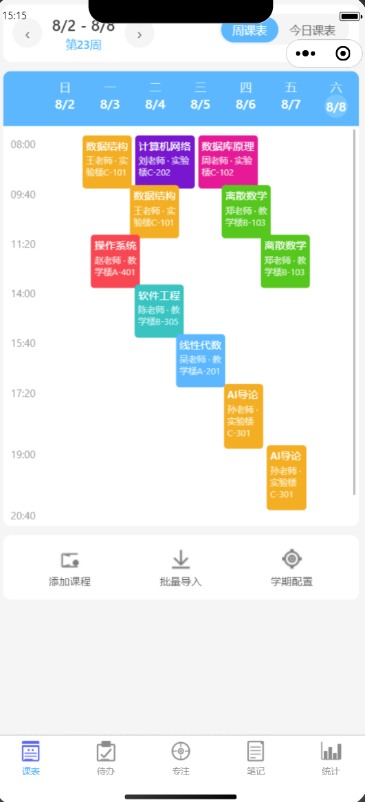
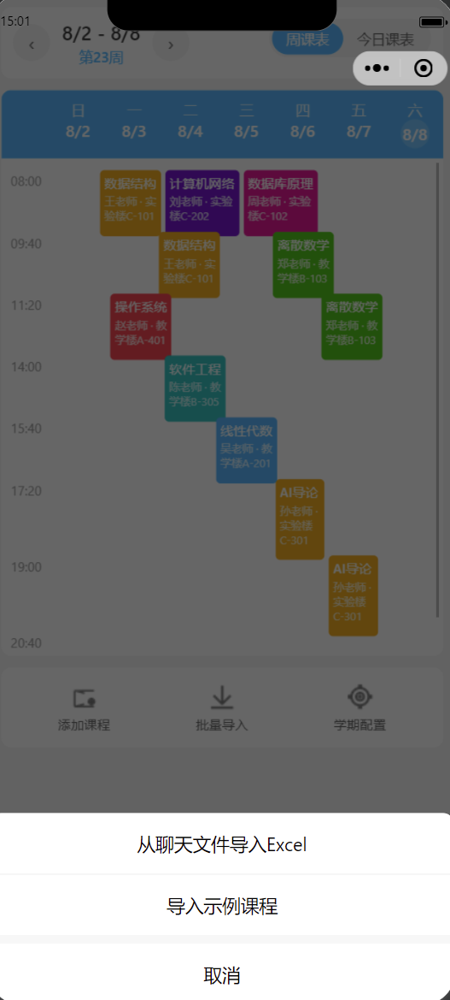
### 代办页面
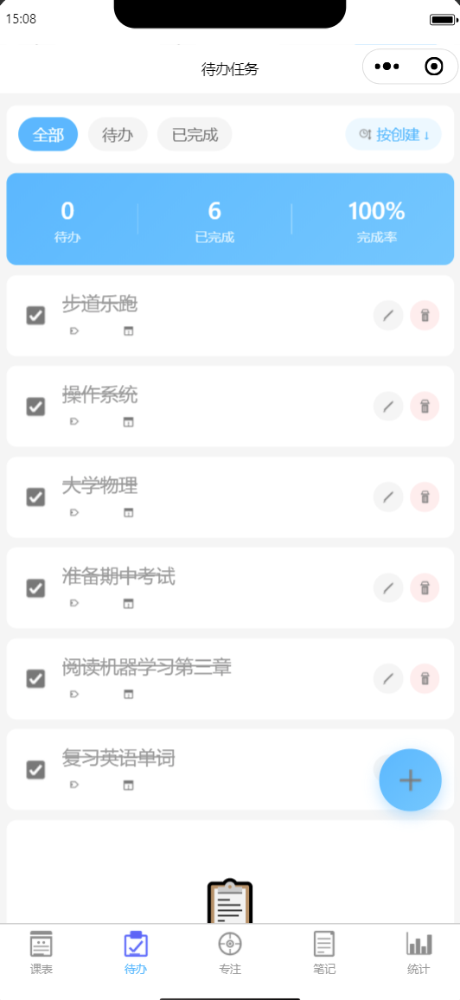
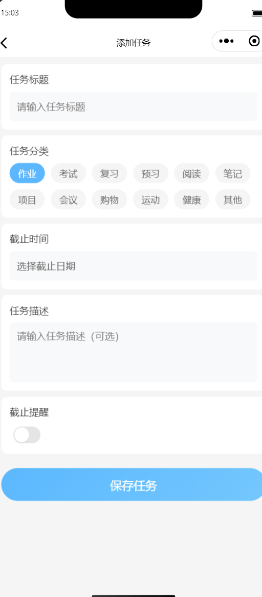
### 专注页面
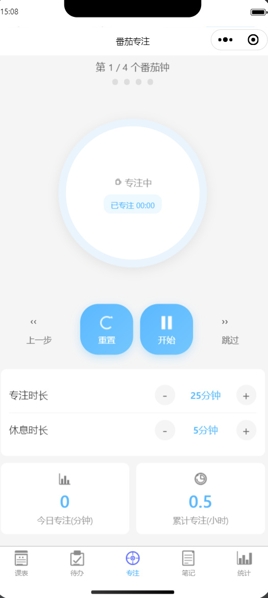
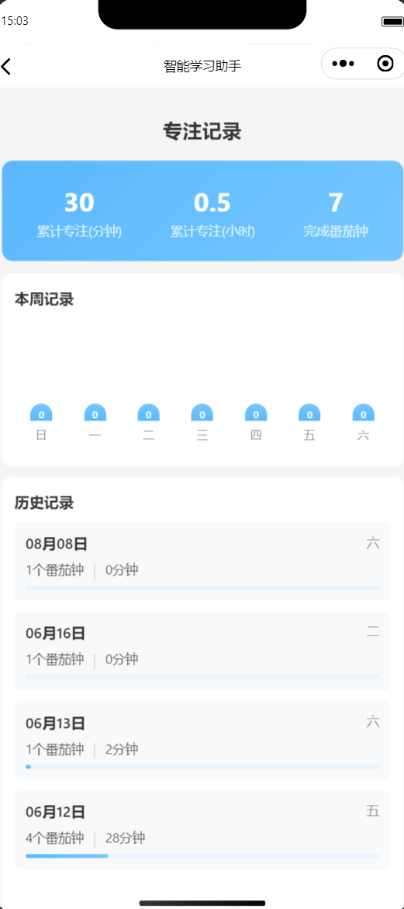
### 笔记页面
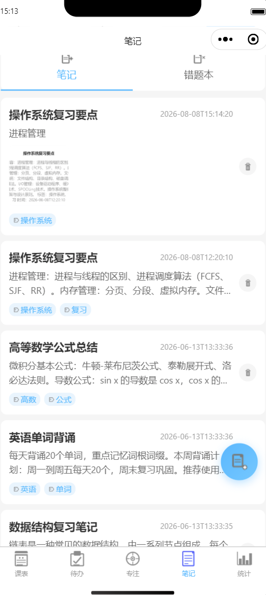
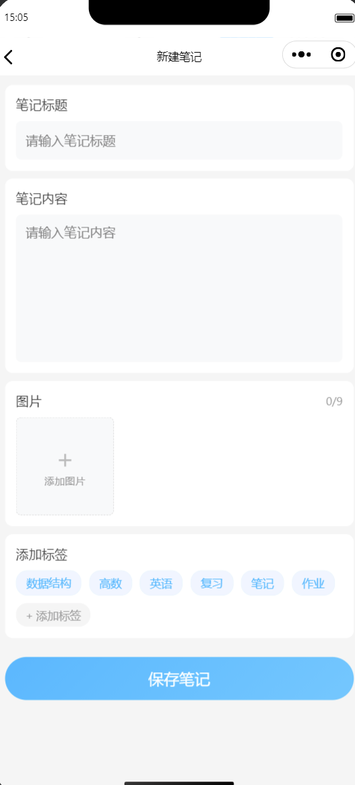
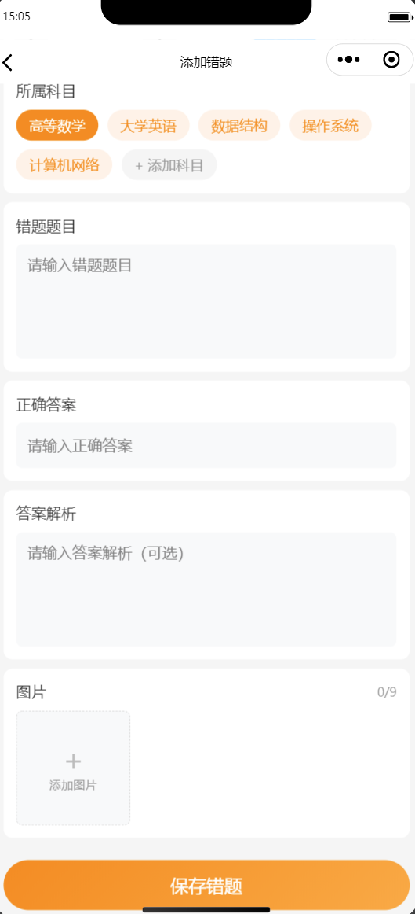
### 统计页面
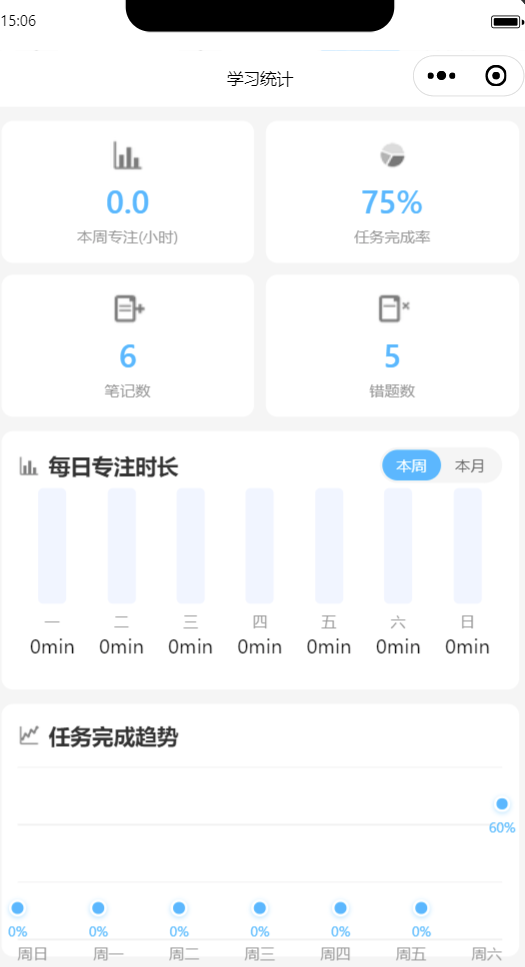
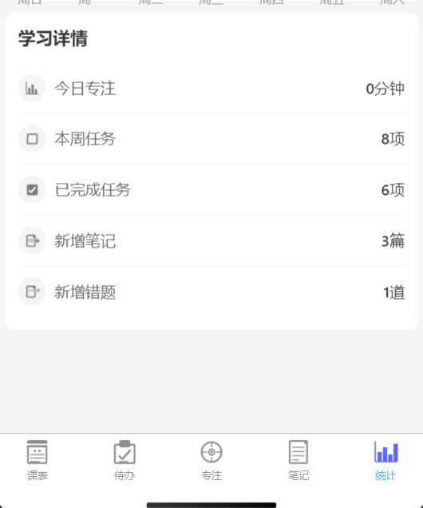
## 后端管理平台
### 课程管理
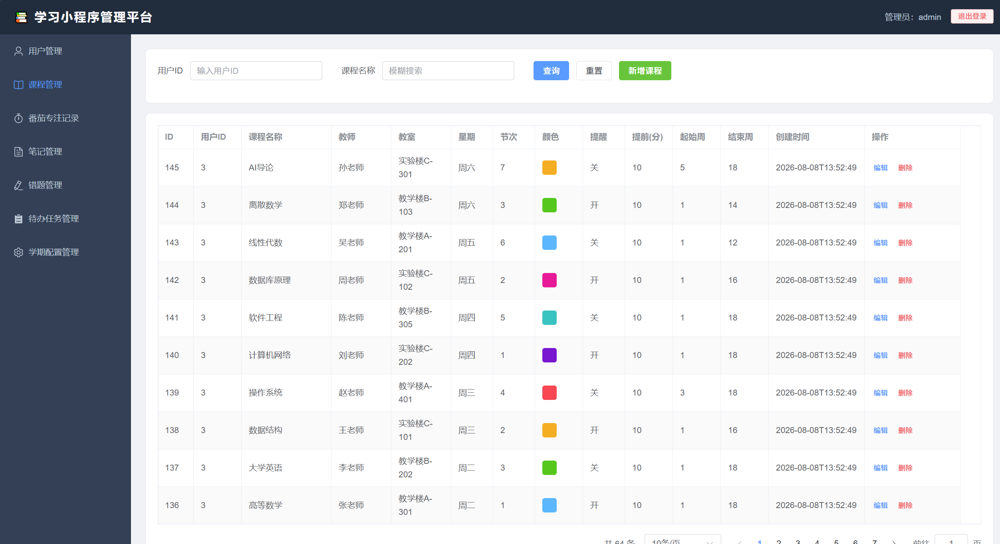
### 番茄专注
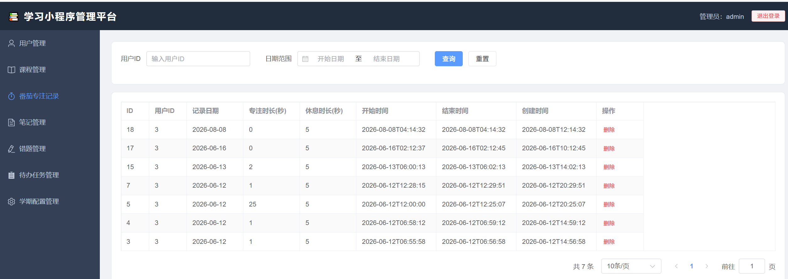
### 笔记管理
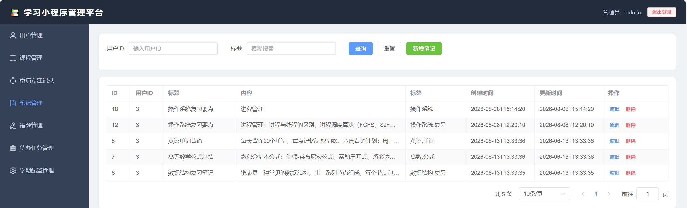
### 错题管理
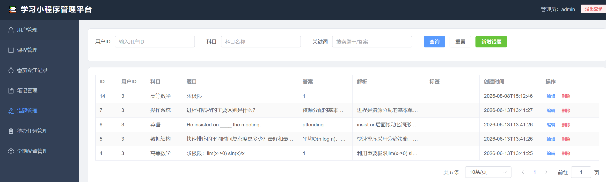
### 代办任务
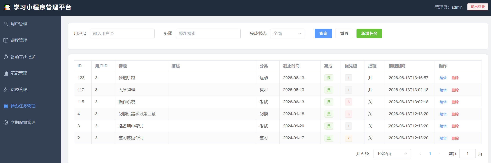
